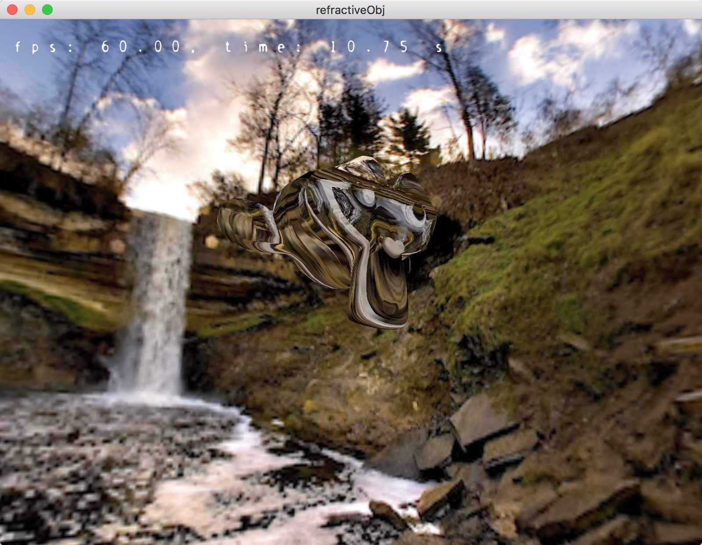

# Project Log

refractiveObj

图形学进展研究的大程，按照日记的形式记录了每次 commit 的内容和心得。

论文：Interactive Relighting of Dynamic Refractive Objects 

[https://www.google.com/patents/US20100033482](https://www.google.com/patents/US20100033482)

## 0.1 创建工程

May 27

创建 Xcode 工程，创建 Git Repository。参考 [https://help.github.com/articles/adding-an-existing-project-to-github-using-the-command-line/](https://help.github.com/articles/adding-an-existing-project-to-github-using-the-command-line/) 注意新建的 repository 不要加东西（README），否则可能没法 push 

## 0.2 GLSL使用

May 27

根据教程第二课的内容显示红色三角形。

本项目中除了 main 外的 C++ 文件，统一以一个文件一个 class 的形式保存。目前的几个 class 调用情况如下。

main

- Render
  - Model @保存模型信息，本项目对 MVP 变换要求不高，不需要利用 class 保存
  - GLSLProgram @这个对象保存一组shader构成的程序管线

## 0.3 Controller

May 28

专门写了视角的控制器。通过监测鼠标动作，完成拖动视角的效果，不错。

## 0.4 model导入

May 28

把教程的代码拷来用。能够读取 obj 文件，并在光源下显示。注释了 Texture 的部分，颜色是由 model 坐标决定的。

下一步想做的事：

- 写一个 Texture 使用的类，然后显示 background 的内容。
- 修改 controller，右键旋转物体，添加 fps 显示器

## 0.5 texture & background

May 29

写了一个Texture管理的类，显示了一个3个面的墙角作为背景，调用了纹理贴图。

## 0.6 object rotate

May 30

把 Controller 进行了修改，分离出 object 的 Model，可以旋转等。

增加了右键旋转 object 的功能。增加了zoom out/in 的功能，z/x 两个键控制。

## 0.7 text2D

May 30

增加了一个 text2D 类，可以显示文字

修改了一些类成员的关系，对于一个 program，uniform 的句柄全都保存在 program 类里面

下一步事项：

- 开始写 shader 代码，试着导入 Texture3D，color 由 radiance 累加获得

## 1.0 3d Texture

May 30

object 用一个新的 shader 来绘制，颜色由一个 3d texture 决定。目前遇到的问题是，这个 radiance 的三位数组可能很有限，无法获得很高的精度。

注意在 shader 中取值的时候，uv的范围应该在 0-1 之间。

## 1.1 voxelizer

Jun 5

数学资料 [http://geomalgorithms.com/a06-_intersect-2.html](http://geomalgorithms.com/a06-_intersect-2.html)

把网格数据保存到一个 3D 数组中，有个好用的函数 intersectRayTriangle ，其他类似的相交函数也在 glm/gtx/intersect 中。

一些默认设定：

- 体素立方体边长为 VOXEL_CNT，是把 (-1, 1) ^ 3 的空间切割成 VOXEL_CNT 份。
- 对于物体某个点，从 texture 取值的时候，先把它从 (-1, 1) 的空间域转变到 (0, 1) 上。

#### attention:

- uniform 传递 texture 的时候类型只能为vec4
- 不知道为什么，vec4(1,0,0,0) 和 vec4(0,0,0,1) 的取值都只能用 a 通道。【已解决】glBindTexture 的参数不小心用了 2D 的，换成3D的就好了。

## 1.2 naive GLSL refractive

Jun 5

试图去使用 refIndex 来控制视线路径。

nextPos 函数从周围6个方向的相邻体素中选择最合适的，然后那些没有被体现的方向向量我用 dirRemian 来保存，这样子一个小角度的倾斜在经过好几个体素的时候也会折一下。

## 1.3 Voxelizer by OpenCL

Jun 6

试着加入了OpenCL代码。好在之前有自学一点，而且它的语法跟 C 是统一的，编译工具也比 GLSL 好。可以说，计算什么的都可以放 CL 上，比较方便调试。

用 CL 代码实现了之前 C++ 写的 voxelizer，求射线和三角形交点的函数自己抄了一遍 glm 的， CL 自带的数学工具很少，只有三角函数之类的，还有几个 cross/dot 这样的向量运算工具，然而居然限定 float4 类型？

运行调试，可以显示 1.2 时的效果（虽然并不知道1.2的效果有没有问题，这个折射还是比较坑的）当 VOXEL_CNT = 32 时，帧率 48 左右，有点糟心。

## 1.4 Advanced Voxelizer

Jun 7

这次要按论文说的那样稍微高级一点进行体素化。

- 对于物体表面边界体素，进行 4x4x4 的 super-sample 来获取一个覆盖率的值
- 对所有体素进行一个高斯模糊

高斯模糊最后发现比较难做，先搞一个普通的加权平均。

VOXEL_CNT = 32 的情况下，

- without super-sample & blur, time = 0.15s
- with super-sample & blur, time = 2.27s

加了超采样和模糊的代码之后貌似效果还不如不加，当然我这个 view pass 肯定是有问题的，再看看论文吧。

## 1.5 ray path by gradient

Jun 7

仔细看了论文之后了解到，光线路径符合一个简单的方程，其中的倒三角算子[nabla] 指的是梯度 gradient 。对于一个标量 n 在三维空间内的梯度，求个导数即可，根据这个方程可以很快的算出光线经过的下一个体素，比我之前的 nextPos 函数要高到不知道哪里去了。

- 需要进行一个预处理，把 n 求一下偏导，由 CL 实现。我把折射率和它的梯度索性用一个 vec4 来保存，其中 rgb 通道传递梯度，a 通道传递 n 的值。
- 在 shader 中，用两句话就可以递推下一个位置，可能至少快了5倍（还不知道 refract 函数的效率以及原来的代码到底对不对）

完成之后的效果，采样数32时预处理时间为 2.0s 左右（比原来还快是因为我原来用了一个3层for循环来把一位数组展开到3维上，后来我发现直接 readbuffer 输出到 3 维数组即可）在采样数42的情况下，fps = 60. 采样率超过42的时候，整个效果突变了，可能存在一些问题。

待解决的问题：

- 我发现我的 voxelize 的代码中分成多个部分，每个部分都必须保证所有单元运行完了上一步才行。这种情况下，要么分多个 kernel，比较保险，貌似还有一个函数 barrier
- 为什么会左右不对称

## 1.6 synchronize threads

Jun 8

上一步遗留的 bug ，进程需要进行同步，否则对于某个全局变量的读和写的顺序会混乱。用 barrier() 实现。实现后的效果，整个色彩很圆滑，不错。预处理时间从2.0s 上升到 2.7s

调试了一下，采样率降低到8的时候是左右对称的。迷。

## 1.7 skybox & bgcolor

Jun 8

这次的任务是实现天空盒，然后物体从天空盒中取色。一篇不错的博文 [http://antongerdelan.net/opengl/cubemaps.html](http://antongerdelan.net/opengl/cubemaps.html)

效果还行，出现问题的地方估计不是 skybox 产生的，而是 voxelize 过程中的问题。检测的方式是，取色直接取直线后方的 cubemap，如果看上去跟背后的图案一样则说明 cubemap 的映射是ok的。

## 1.8 cubemap2

Jun 8

经过验证，当采样数降到 8 的时候，效果完美。为什么采样数增大会有 bug 尚不可知。目前已知的临界点，超过8，透射效果就会乱掉；超过42，全都是一个颜色。

新做了一个 CubeMap - river，效果不错。

## 1.9 GL_Texture to CL_Mem

Jun 9

一些代码的修改：

- voxelizer 部分独立成类
- 把 3D array -> texture 的部分封装成了 Texture 类成员函数
- 新建了 main.hpp 来保存一些宏、头文件等
- 新建了一个 ball.obj 来更好地观察折射效果（这个球也太不光滑了点）

本次任务：

按照 shadowmap 的方法生成一个 photon list，用 OpenCL 代码调用这个 texture 

测试：

用 OpenCL 的函数 clCreateFromGLTexture ，把 texture 转变成 cl_mem 类型，再在 kernel 中使用。

写一个简单的 kernel，把 texture 的内容输出显示。

#### 遇到了困难

上述函数一直调用失败。

- 经过大量查阅资料后，在一篇 SIGGRAPH ASIA 09 的文章《GL-interop》里面看到了关于 CL/GL 交互的详细代码，需要特殊的 context、share group、acquire resource 等操作才可以使用这个 cl_mem。
- 然而，之后还是报另一个错，SetArg 失败。又经过大量查阅 stack overflow 之后，终于在一个人的问题中看到了答案，原来生成的 cl_mem 不是我想的那种二维数组 float4 （仔细想想 CL 也不能使用二维数组啊），而是 image2d_t 类型的。必须用这个类型作为 kernel 的参数。
- 然后，显示的数组内容依然不是我想要的 0 1 数组。看了半天，发现自己把float 类型用 %d 输出了，难怪。
- 最后，显示的数组内容均为 0 。看来是 texture 渲染的时候没有生成好吧。需要一个 debug 窗口。

#### 小结

做了一整天就光研究这么一个函数了，想来为什么会花费掉这么多时间呢。重点还是因为对这个平台不熟悉。这种情况下，只能看 document 边试边写。但是尝试是有限度的，必须要依靠一些 example code。

## 1.10 photon map

Jun 10

增加了一张小桌子（平面），我利用它来观察 depthTexture 的情况。

最后把 depthTexture 的部分改回原来那个样子就好了。

时间测试：photon map 的渲染 + cl_kernel 运行 < 0.1 s

不错的一个结果。

下一步工作：

将 photon map 的3D空间位置找到，然后对这些光子进行简单的 march ，修改radiance 。

